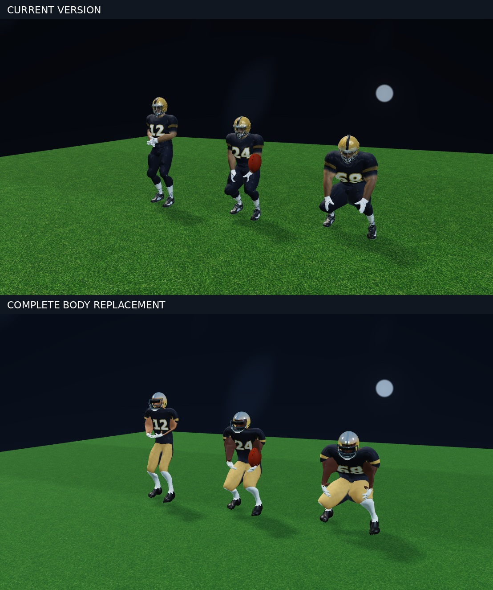
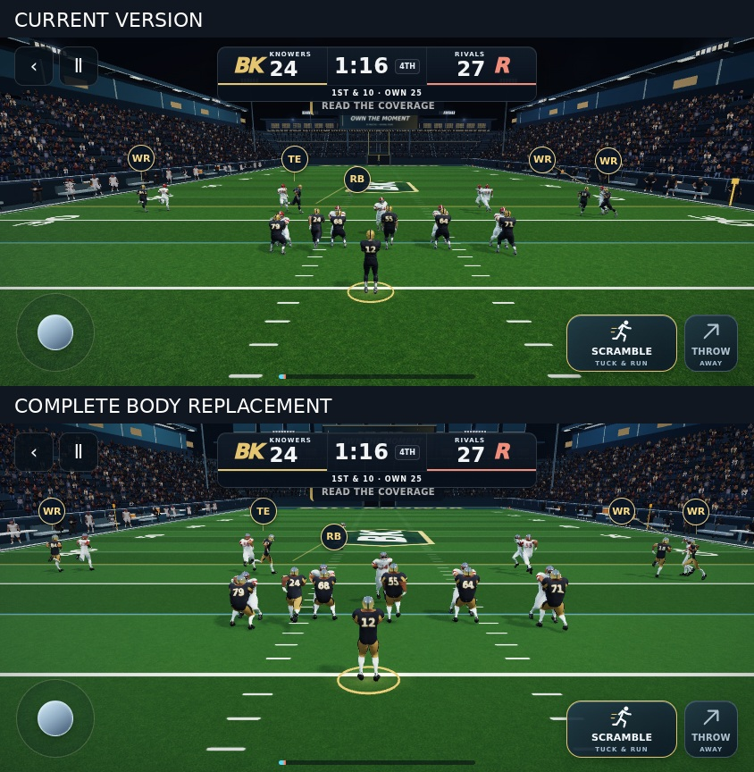
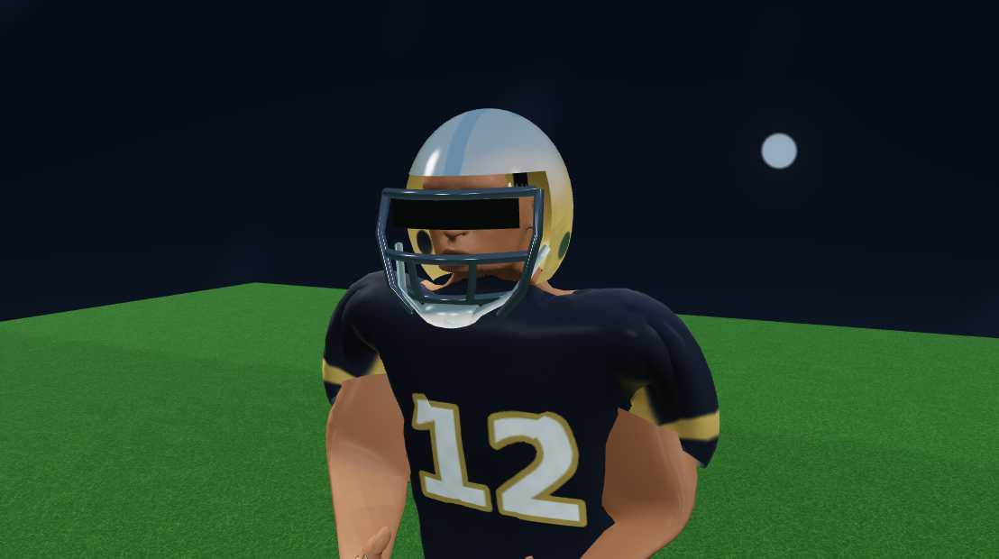

# Complete anatomical player replacement

The earlier equipment-only remodel left the original generated body in place. This replacement rebuilds the torso, limbs, hands, face and clothing from pinned MakeHuman CC0 graphical assets, including adult male muscle/weight morphs. The face retains its original anatomical proportions while body landmarks are fitted to the existing game skeleton.

The runtime now loads `ball-knower-anatomical-athlete-v6.glb`: 2,757,172 bytes, 22,972 vertices and 40,968 triangles. The eight animation clips, skeleton and inverse bind matrices are preserved byte-for-byte. The model has explicit skin, cloth, pants, socks, gloves, cleats, shell, cage and visor regions. Sleeves use anatomical arm weights; pads cannot inherit head movement. The complete body is new; the authored shell and cage from the prior local prototype are reused.

The surrounding presentation includes the previously developed stadium bowl/lighting/turf work, revised uniforms, and a closer passing lens (44 degrees rather than 58 in landscape). Camera framing checks still keep the quarterback clear of controls. No simulation rules or other app destinations are removed.

## Review images

These are captures of the actual WebGL renderer. Player comparison uses matching poses and camera. Gameplay comparison also includes the deliberate camera/framing change.





## Rebuild

Requires Python with numpy, scipy and Pillow. Run:

```sh
python scripts/prepare-player-foundation.py
python scripts/build-anatomical-athlete.py
node scripts/check-anatomical-athlete.mjs
```

The intake verifies pinned Git blob hashes and CC0 headers. Source provenance and asset license are in `docs/qa/anatomical-remodel/`. The equipment helper writes an intermediate file beneath `artifacts/`; the rejected v5 runtime asset is not shipped by this change. The source graphical license is also described at https://static.makehumancommunity.org/about/license.html.

## Validation and limits

- TypeScript check and production build pass.
- Asset contract verifies unchanged skeleton, bind matrices and all eight clips; finite vertices, normalized weights, valid indices, material regions and grounded footwear.
- Locomotion and foundation checks run against the replacement GLB: grounded strides, reciprocal arm movement and recovery continuity pass.
- Real mobile-viewport WebGL graphics gate passes: 22 player shadow draws, 41 scene draws, no GL errors or instance overflow. Three catch styles pass hand/ball continuity limits. Role proportions and ground contact are checked on the GPU-deformed surface.
- Blocking/recovery browser check and complete deterministic run/pass checks pass. Both plays finish and return to the playbook. These full-play checks preceded the final face-fitting refinement; the final mesh passes the graphics gate.
- Physical iPhone/Chromebook frame rate is not certified by software-rendered browser tests. The new mesh has more triangles than v4 (40,968 versus 31,070), with a smaller download (2.76 MB versus 6.47 MB).
- This remains a stylized real-time model. The screenshots, rather than claims of photorealism, are the visual acceptance evidence. This branch has not been merged or deployed to production.
