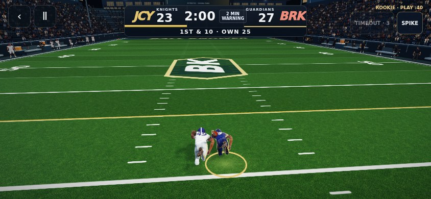
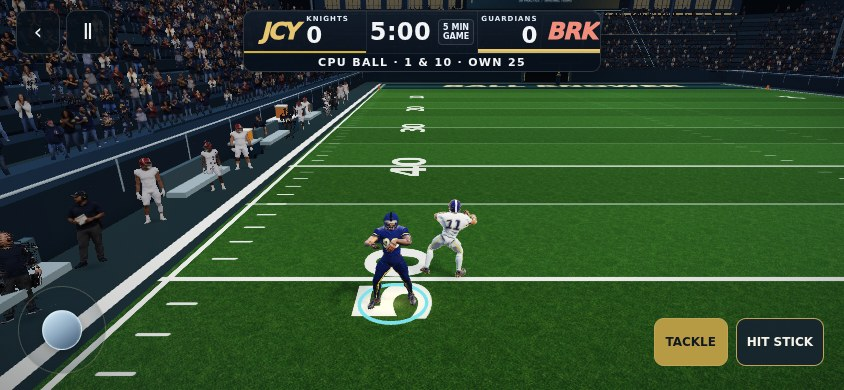
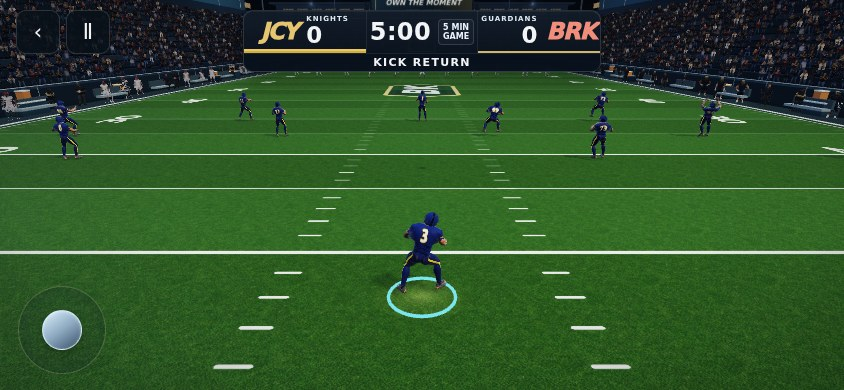
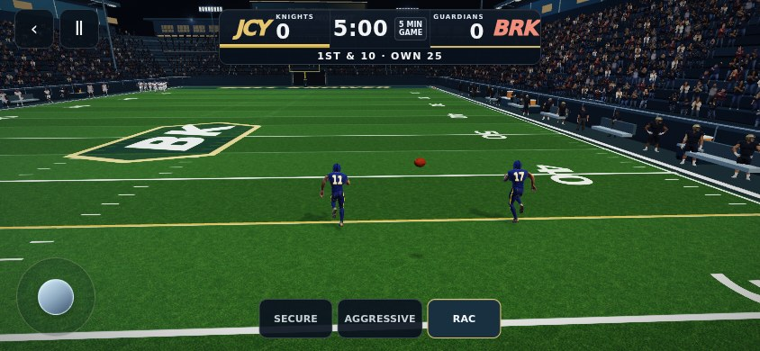

# Contact timing, return framing, and catch input

Follow-up to #437, based on the October 4 mobile recording. Applies to the two-minute and five-minute games.

## Changes

- Hold the down, result, and next possession until the tackle animation finishes and rests on the turf for 120 ms. This includes fourth downs, expired clocks, conversions, defensive stops, and kick returns.
- Frame kickoff and punt returns around the returner and landing area instead of the distant kicker and high ball apex. Preserve existing pre-kick and goal-kick views.
- Bring defensive action closer, widening only to contain the controlled defender and local action. Bound camera boom movement independently from tracking movement.
- Give short passes a 1.05-second catch decision window through continuous slow motion after release. Ball, routes, defenders, and game clock slow together; selecting a catch restores normal speed immediately. Touch input registers on press, keyboard input remains supported, and no selection defaults to RAC.

Helmets, athlete models/materials, and Combine are unchanged. No changes to shared app navigation or roster state.

## Verification

- `BROWSER_PATH=/tmp/chromium node scripts/check-contact-framing-catches.mjs`: PASS, 30 regression cases across both modes, mobile 844 × 390 with touch. Checks actual rendered chest positions, delayed result/down updates, fourth-down/clock/conversion endings, defense and kickoff tackles, close defense at both sidelines and center, 844 kick-flight camera samples, and catch selection at 0.85 seconds for all three styles. Zero browser page errors. Default RAC and pre-release control visibility also checked.
- `scripts/check-full-game-transitions.mjs`: PASS, 2,172 handoff/catch transition frames across both modes. Only screenshot output directory changed for this run.
- `scripts/check-camera-contact-polish.mjs`: PASS, backed-up offense visibility, rear tackles, monotonic return clock, compact fair-catch controls, edge protection, mobile playbook.
- `node scripts/check-five-minute.mjs`: PASS, 90 seeded complete games.
- `node scripts/check-field-awareness.mjs`: PASS.
- `npm run lint`: PASS (TypeScript).
- `npm run build`: PASS; existing large-chunk warning.
- `git diff --check`: PASS. Combine, helmet assets, and reference athlete source unchanged against main.

These are local Chromium mobile checks, not a physical iPhone run. Production deployment identity and TLS-verified file checks will be recorded on the PR after release.

## Screenshots

Raw regression results: [results.json](qa/contact-framing/results.json).
