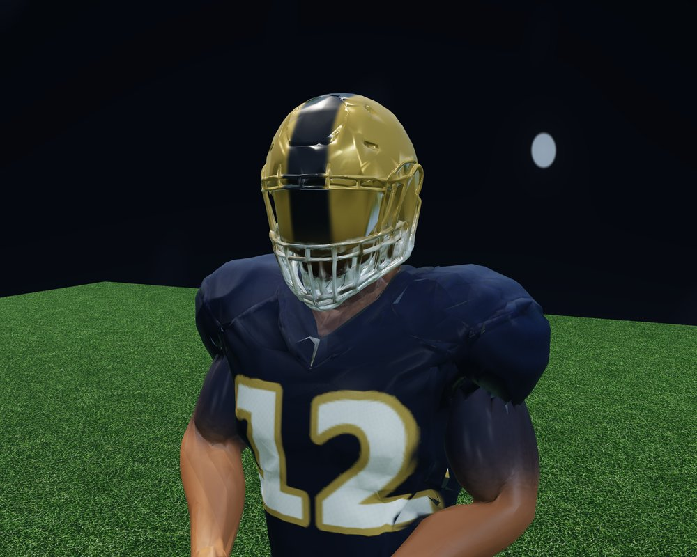
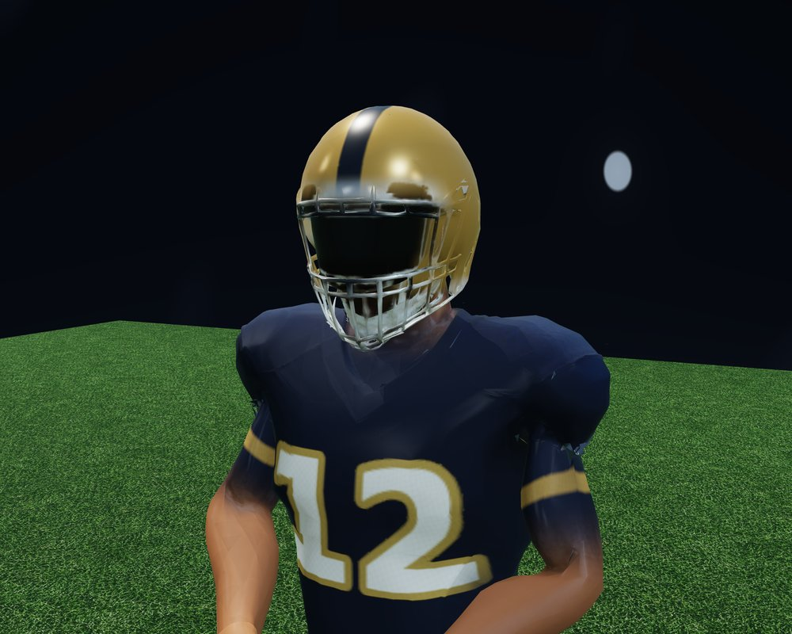
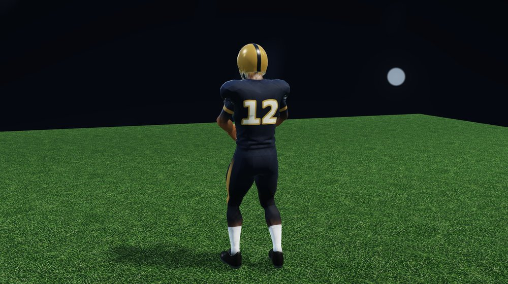
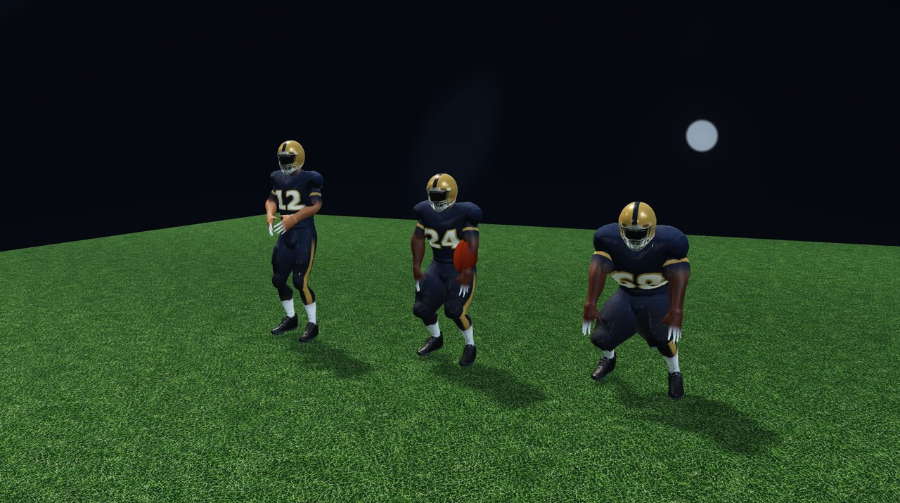
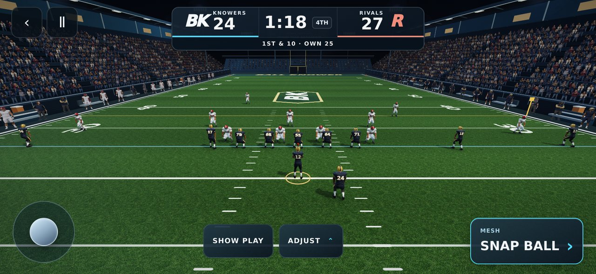

# Athlete graphics refinement — September 28, 2026

The owner asked for a further graphics upgrade after the night-stadium pass. This update focuses on the actual skinned players. Close-up inspection found sharply discontinuous surface shading, inflated position-specific shoulder offsets, and a helmet paint mask that extended over the eye shield.

## Changes

- Regularize the helmet crown and rear shell, with at most 0.019 m of displacement on the shipped asset. The original face cage, neck, hands, feet, UV layout, skin weights, triangle topology and animation clips remain intact.
- Reconstruct shared surface normals across split UV vertices, filter small lighting dents, and re-orthogonalize tangents. The helmet receives a smooth curved lighting normal while the cage retains its harder edges.
- Separate shell paint, the dark eye shield and the front face cage. Narrow the center stripe, soften metallic reflections and reduce exaggerated normal-map noise.
- Reduce shoulder-pad expansion for six position builds. Preserve their existing overall scale, torso and thigh differences.
- Add sleeve and pants trim, subtle jersey side panels, smaller live roster numerals and cleaner matte fabric shading for both teams.

The refinement runs once during model loading, then both the visible and shadow passes use the same buffers. No additional textures, triangles, draw calls, model downloads or runtime services are introduced. The asset remains 28,988 triangles and 36,618 attribute vertices. A single local Node measurement took 269 ms for the preprocessing step; this is not an iPhone timing claim. Low-end-device startup time still needs observation.

## Actual renderer comparison

The two close-ups use identical model, pose, camera and lighting. These are captures of the WebGL player, not generated concept artwork.

Before:



After:





Final QB, running back and lineman review (closer review camera):



Final unchanged gameplay camera:



## Verification

The presentation gate now measures the refined asset, verifies finite unit normals and orthogonal tangents, protects untouched contact geometry, bounds shell displacement, and exercises 2,787 actual-asset poses. The WebGL gate measures all eight position builds using transform feedback and captures the mobile snap/pass/throw flow, equipment close-ups and shadow-disabled fallback.

Verification commands:

```sh
npm run lint
npm run build
node scripts/check-football-locomotion.mjs
node scripts/check-football-presentation.mjs
node scripts/check-football-recovery.mjs
BROWSER_PATH=/root/.cache/ms-playwright/chromium_headless_shell-1161/chrome-linux/headless_shell node scripts/check-football-graphics.mjs
```

Type checking, production build, locomotion, presentation and recovery checks passed. The production build reports the repository's existing large-chunk warnings. Mobile passing, 24 GPU surface measurements across eight builds, catch transitions and shadow fallback passed with zero page errors, zero instance overflow and 39 scene draw calls. These browser results use Chromium software rendering; physical iPhone/Safari performance remains unverified.

## Visual limits and handoff

This improves the existing model. It does not make it photorealistic. The source still has rough shoulder/neck transitions, a distorted facemask and limited cloth/anatomical detail. Reaching the supplied reference requires a better authored athlete mesh and animation assets, followed by actual-phone performance review. Shader refinements alone cannot remove that gap.

**GITHUB HANDOFF BLOCKED.** The earlier push of this branch was rejected by automatic approval review because explicit current-chat authorization to publish the code/art to the public repository is required. This refinement remains on the local branch with the preceding graphics pass. No push, PR, merge or deployment is claimed.
