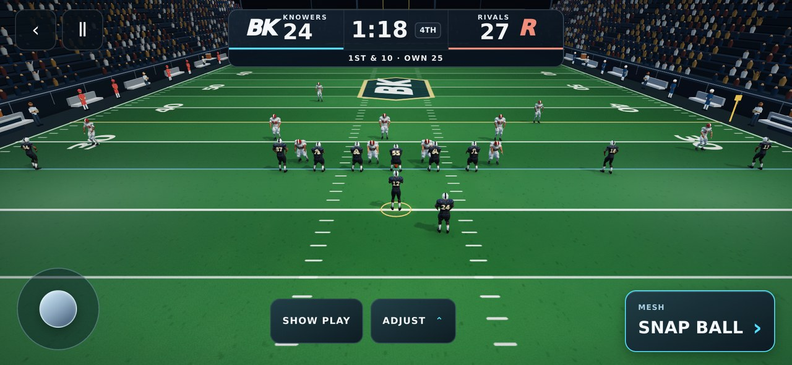
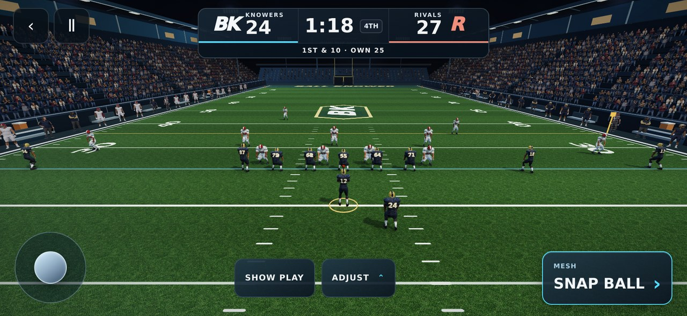

# Football reference scene, September 27, 2026

The owner supplied a night-football reference and asked to bring the playable game as close as possible. This pass changes the real WebGL scene, rather than substituting a painted gameplay background.

## Changes

- Original tiled turf artwork with mipmaps, up to 8× anisotropic filtering, fine surface response and existing accurate field markings. The old painted light-pool overlays are removed.
- Sixteen audience cutouts and sixteen sideline player/coach cutouts, rendered as camera-facing, alpha-tested instances. These are distant scenery, not the controllable athletes. The crowd is denser and the sidelines use the teams' navy/gold and white/red uniforms.
- Additional visible floodlight banks, more subdued benches, and a sideline border.
- Metallic gold home helmets, more readable navy cloth, grounded shadows, and football stances authored from the existing skeleton's bind pose. No new on-field model or motion-capture clips are claimed.
- Landscape camera framing with the existing projected receiver/feet fit checks and smooth camera travel. Gameplay rules, playbook, saves and controls are preserved.

The additional art loads asynchronously from the same origin. If any image fails, the corresponding procedural appearance remains playable. The high-quality default and existing shadow-disabled fallback remain available internally.

## Assets and provenance

Created with the built-in image-generation tool, then converted to 1024×1024 WebP for the game. The transparent atlases preserve alpha; no external image URLs, purchased assets or additional runtime services are required.

| Saved asset | Final generation specification |
| --- | --- |
| `public/play-moment-3d/assets/stadium-turf-v1.webp` | Square seamless orthographic scan of densely cut stadium ryegrass, fine varied blades and subdued green tones, uniform diffuse light, no field markings, objects, text or baked directional shadows. |
| `public/play-moment-3d/assets/stadium-fans-v1.webp` | Transparent 4×4 atlas of sixteen realistic full-body adult football spectators in navy/gold, gray, cream and muted burgundy clothing, varied bodies and cheering poses, isolated cells, front/three-quarter view. |
| `public/play-moment-3d/assets/stadium-sideline-v1.webp` | Transparent 4×4 atlas: eight navy/gold reserve players, four white/red reserves and four coaches/staff with headsets or clipboards; full-body relaxed poses, diffuse light and isolated cells. |

## Evidence and verification

Browser captures from the same phone-sized viewport and pre-snap play:





Verification commands:

```sh
npm run lint
npm run build
node scripts/check-football-recovery.mjs
node scripts/check-football-locomotion.mjs
node scripts/check-football-presentation.mjs
node scripts/check-play-moment-framing.mjs
node scripts/check-play-moment-night.mjs
node scripts/check-football-graphics.mjs
node scripts/check-football-scene.mjs
```

The graphics gate compiles the real shaders, checks rendered mobile passing/throwing, measures the GPU-deformed surfaces for eight roles, validates catch transitions, and exercises the shadow fallback. The scene gate checks all five formations at four landscape sizes and starts a pass with all three optional scene images deliberately unavailable.

## Remaining limits

This moves the environment toward the reference; it does not reproduce the reference exactly. The existing playable athlete mesh and most animation work remain the next quality limit. Crowd and sideline art uses flat distant cutouts; it is not full 3D spectator animation. Browser tests use Chromium software rendering and do not establish physical-iPhone frame rate, thermal behavior, or Safari GPU performance. Three extra 1024² RGBA mipmapped textures add approximately 16 MiB of GPU texture storage; transparent crowd overdraw also needs real-device observation.

## Local release result

- Type check and production build: passed (existing large-chunk warnings).
- Recovery/gameplay, grounded locomotion, 2,787 real-asset presentation poses, camera/marker projection, and bounded-graphics checks: passed.
- Scene browser gate: passed all 20 formation/viewport combinations, with zero page errors and a successful passing play when all three artwork requests were blocked.
- Real WebGL graphics gate: passed the mobile pass/throw flow, eight-role surface measurements, catch transitions and shadow-disabled fallback.
- Publishing: **GITHUB HANDOFF BLOCKED**. Automatic approval review rejected `git push` because it requires explicit authorization in the current trusted conversation to publish this code/art payload to the public repository. No remote branch, PR, merge or production deployment was created by this task.
