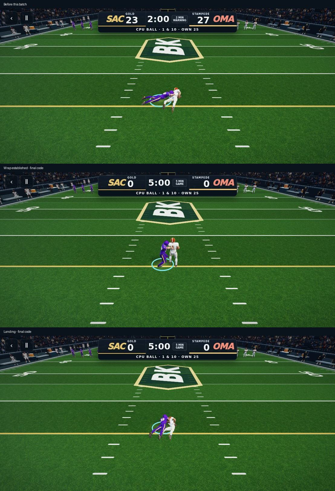

# Contact, blocking, exchange and presentation review — October 7

This batch addresses all four areas requested after PR #446. The approved running cycle, helmet asset and Combine are preserved.

## What changed and why

- **Tackles:** the defender establishes the wrap before the carrier falls; both settle closer together and align with the impact direction. CPU contact travel now has a drive/landing interval instead of spending most displacement immediately. Wrap, drag and dive finishes are distinct.
- **Grounded ball protection:** the old downward elbow bend could put a forearm below the turf. Ground support then lifted the entire athlete to compensate. Contact arms now bend outward above the surface and protect the abdomen/ribs. The actual helmeted rig is tested on both sides across seven variants; wrap/drag/dive head height must settle below 0.45 world units, and carrying hands/ball remain supported.
- **Blocking:** neutral balanced contact stances replace stacked generated bends. Shorter foot resets follow distance traveled. Both opposing torsos are resolved before either player's hands, eliminating previous-frame chest targets and roster-order lag. The prepared poses are reused rather than animated twice. A moving pair's hand target error is measured on the shipped rig.
- **QB:** a timed release follow-through withdraws the hands after the handoff. CPU quarterbacks step through the exchange and stop clear of the runner; possession remains singular.
- **Frame pacing:** presentation previously subtracted a fixed 1/60 second even when catch slow-motion scaled the simulation step. At high refresh this could make pose time run backward and reset blending. Presentation now interpolates the actual previous/current simulation timestamps. Unchanged skill-button DOM states are also no longer written every render.



## Tests and visual review

- Type check and production build passed (existing large-bundle warnings).
- Pursuit, 75 route/flow paths and 60 complete-game rules scenarios passed.
- Both-mode CPU handoff/completion, seven contact variants and four mobile viewport checks passed.
- `check-reference-contact.mjs` loads **reference-helmeted-athlete-v1.glb**, checks 14 side/variant landings, ball protection, finite bones, and a moving blocking pair. Results: `reference-rig.json`.
- `check-presentation-clock.mjs` runs the actual presentation path at 120 Hz during scaled catch flight in both modes. All 72 sampled pose times are monotonic. Results: `presentation-clock.json`.
- Normal-control pass/scramble/catch/punt/defense and 2,172 camera-transition frames are recorded in the PR validation result.
- Reviewed the entire deterministic run sequence, including exchange, blocking, contact and next play. Reviewed contact stages separately after the final arm correction.

## Real-time limit

The review driver now supports a `realtime` command that resumes the shipped requestAnimationFrame loop and saves CDP screencast frames with actual timestamps. A normal-control run advanced through snap → handoff → run → tackle → next play (gain seven) with one ball owner and no page/WebGL errors.

The hosted SwiftShader software renderer was extremely slow under concurrent capture (roughly 19–24 rendered frames per 20–33 wall seconds), and screenshot requests timed out under concurrent capture. The normal-control review now uses direct CDP frame capture to avoid an additional screenshot wait. This is **not physical iPhone FPS evidence**, and no smooth-60-FPS or phone-performance certification is claimed. Deterministic recordings and the high-refresh clock regression verify the timing correction separately. Real hardware performance remains unverified.

## Repeat

```sh
node scripts/check-reference-contact.mjs
BROWSER_PATH=/path/to/chromium node scripts/check-presentation-clock.mjs
BROWSER_PATH=/path/to/chromium node scripts/check-oct7-playthrough.mjs
BROWSER_PATH=/path/to/chromium node scripts/check-oct6-gameplay.mjs
BROWSER_PATH=/path/to/chromium node scripts/play-game-review.mjs
```

After loading and snapping in the review driver:

```json
{"action":"realtime","label":"normal-clock-run","seconds":20}
```

Use `record` for deterministic frame-by-frame review, and `realtime` for uninterrupted animation-loop behavior. Keep both forms of evidence; neither a geometry assertion nor one screenshot establishes animation quality.
