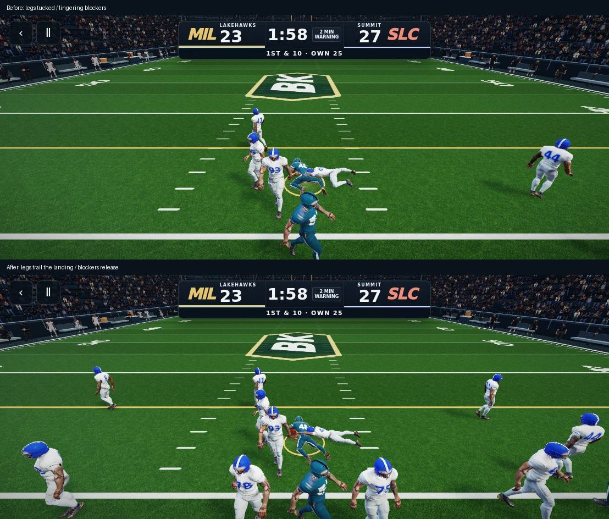

# October 7: agent-controlled play review

The owner should not have to record each iteration. `scripts/play-game-review.mjs` runs the actual shipped UI with keyboard/touch controls, a seeded random stream, and the real 60 Hz simulation/presentation pipeline. It saves timed screenshots and per-frame diagnostics without injecting positions, catches, scores, or tackles. This is deterministic browser review, not a measurement of physical iPhone performance.

## Reproduced and corrected

- Pass protection used `elapsed`, which resets at scramble/catch. A separate protection age now continues through those transitions; pocket escape also releases the engaged rushers.
- Run blockers continued their assigned engagement after the carrier passed them. Those pairs now release and defenders pursue.
- An unengaged defensive lineman could reuse a stale block animation. Free rushers return to locomotion.
- Authored tackle poses could inherit another tackle bend. Contact starts from the bind pose, ball-carrying arms follow the rotated torso, and trailing legs extend and orient their feet during landing. The animation remains stylized; this does not claim broadcast-quality tackling.
- The QB reached his handoff position early and parked. His exchange step now continues over the handoff interval.
- Short throws gave only a 1.05-second catch decision interval. The whole simulation now slows together for up to a 1.45-second interval, ending when a choice is made; catches are still only offered after release.
- Formation changes could leave the selected play below the visible grid. The selected card scrolls into view.

## Played and inspected

MIL–SLC at 1108×444: inside zone through snap, handoff, run and dive tackle; DRIVE pass, scramble, short RB throw; five-minute punt from own 25, ensuing defensive snap, CPU completion, pursuit/tackle and next down. The first run gained seven yards before and after. The punt led to CPU possession at its 36; the next defensive play ended second-and-five. No page exceptions or WebGL errors were observed. A attempted switch during the automatically controlled flight window was hidden; the driver reported that input failure rather than bypassing the UI.



## Validation

- `npm run lint` and `npm run build`: passed (existing large-chunk warnings).
- `check-football-pursuit.mjs`, `check-football-flow.mjs`, `check-complete-game.mjs`: passed, including 75 paths and 60 game-rules scenarios.
- `check-full-game-transitions.mjs`: passed, both modes, 2,172 handoff/catch transition frames, left/center/right field positions.
- `check-oct6-gameplay.mjs`: both modes passed possession, short CPU completion, four tackle variants and four mobile sizes (1108×512, 1108×444, 844×390, 667×320). A final additional run verified all seven tackle variants, including dive, gang and big hit, with the latest leg finish; that coverage is now part of the script.
- `check-oct7-playthrough.mjs`: normal UI scramble, late SECURE catch choice, selection visibility, punt-to-defense checks. See `report.json` for this run.

## Repeat the review

```sh
BROWSER_PATH=/path/to/chromium OUT=artifacts/play-review node scripts/play-game-review.mjs
```

Send one JSON command per line:

```json
{"action":"load","mode":"two-minute"}
{"action":"click","selector":"#breakHuddle"}
{"action":"key","key":"ArrowUp","event":"down"}
{"action":"click","selector":"#snap"}
{"action":"record","label":"inside-zone","seconds":5,"fps":15}
{"action":"state"}
```

Other commands: `step` with seconds, `shot` with label, `key` with event `up`/`down`/`press`. `REVIEW_URL` can point to a deployed preview route. Review the resulting sequence, not just its final frame. Automated geometry and ownership assertions complement visual review; they do not establish animation quality.
