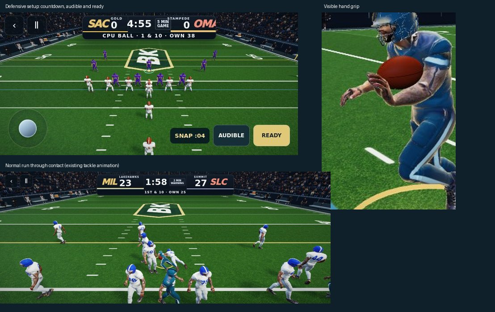

# Touch passing, defensive setup and carry grip — October 7

Owner report: `ScreenRecording_10-07-2026 02-01-42_1.mp4`, following PR #447. Scope is the two full-game modes. Helmets, the running cycle and Combine are preserved.

## Changes

- Receiver badges have 56px touch areas, non-overlapping placement, press feedback, pointer-ID tracking and a click-only activation fallback. A pressed badge stays under the finger instead of following the moving route. Tapping an unobstructed eligible receiver body also submits a bullet pass. Existing tap / hold trajectory selection stays intact. Receiver presses and cancellations are included in gameplay replay events for diagnosing device-specific input problems.
- Calling defense enters a visible ten-second pre-snap window instead of invoking the snap immediately. AUDIBLE reopens the existing full defensive playbook and holds the countdown. Returning to the field leaves at least three seconds; READY starts sooner. Live tackle buttons stay hidden until the snap. Setup time does not consume the game clock, consistent with the existing playbook behavior.
- Carrying hands now stay at the ribs while the approved legs keep running. The ball's forward tip is near the palm, and its center is offset outside the forearm axis rather than embedded between elbow and wrist. This applies on either arm and through contact; exchanges and QB two-handed throwing poses retain their own anchors.

## What the investigation did and did not establish

The original receiver-badge implementation passed six raw CDP multitouch scenarios (both modes × bullet/touch/lob) while holding the joystick. The owner's exact missed pass is **not conclusively reproduced**. The new changes cover additional failure paths, and tests use actual browser touch events rather than direct `throwTo` calls. Device-specific Safari behavior remains a limitation.

## Tackle asset research

- Meshy's documented animation catalog was checked on October 7: no preset named Football or Tackle was listed. Generic combat/fall clips are not a verified paired football tackle.
  https://docs.meshy.ai/en/api/animation-library
- Tomasi Studios' **21 Football Motion Capture Animations for Blender3D** lists `Tackle 001` and `Getting tackled`, plus FBX and Blender formats. The listing advertised $15.50 and an Extended Use License on the check date.
  https://www.renderhub.com/tomasi-studios/18-football-motion-capture-animations-for-blender3d
- This is a concrete candidate, not an imported/validated asset. It has not been purchased or downloaded. No licensed source download was available in this workspace. The listing does not establish synchronized pair timing, root-motion compatibility, or quality on our rig. Before shipping it: acquire licensed files, inspect the two source clips together, retarget only the motions to the existing helmeted rig, and test approach/contact/landing from both sides. No existing character art should be replaced.
- No paid asset was purchased, and no new downloaded tackle animation is claimed in this change.

## Repeatable checks

```sh
BROWSER_PATH=/path/to/chromium node scripts/check-touch-passing.mjs
BROWSER_PATH=/path/to/chromium node scripts/check-defense-presnap.mjs
node scripts/check-reference-contact.mjs
BROWSER_PATH=/path/to/chromium node scripts/check-presentation-clock.mjs
BROWSER_PATH=/path/to/chromium node scripts/check-oct7-playthrough.mjs
BROWSER_PATH=/path/to/chromium node scripts/play-game-review.mjs
```

The review driver supports `tap`, `record` (deterministic full sequences) and `realtime` (actual RAF). Software-rendered browser runs do not certify physical iPhone FPS. Final results and production verification are recorded in the PR.

## Verification result

- Type check and production build passed; existing large-bundle warnings remain.
- Touch tests passed in both modes: six joystick-plus-receiver trajectories, canceled touches, receiver-body taps, and click-only activation.
- Defense tests passed both countdown expiry and READY, audible hold, and 844×390 / 667×320 / 1108×444 controls.
- Actual reference rig: 14 contact finishes, 360 carry poses, and six visible skinned-hand checks passed. Maximum visible-hand-to-ball-tip distance was 0.094 world units. Ball clearance above turf is also checked.
- Presentation clock and normal-control scramble / catch / punt / defense checks passed. Route/pursuit and 60 game-rule scenarios passed.
- Reviewed the complete normal-control run (seven yards, second-and-three), subsequent carry/contact frames, and final grip close-up. Real RAF capture has no page/WebGL errors. The host software renderer remains slow; no iPhone FPS claim.
- The old `check-play-moment-framing.mjs` still fails with its known extracted-fixture `routePoint is not defined` error; no all-green legacy CI claim. Defensive browser fixtures now explicitly press READY when their scenario requires an immediate snap.


