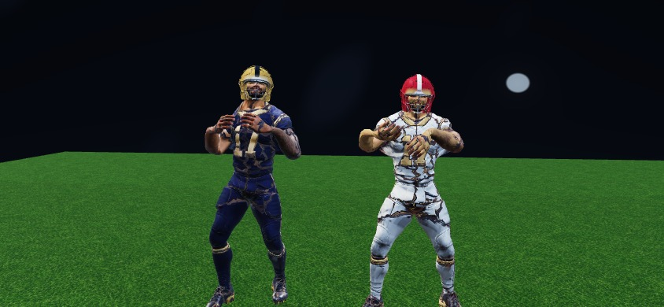
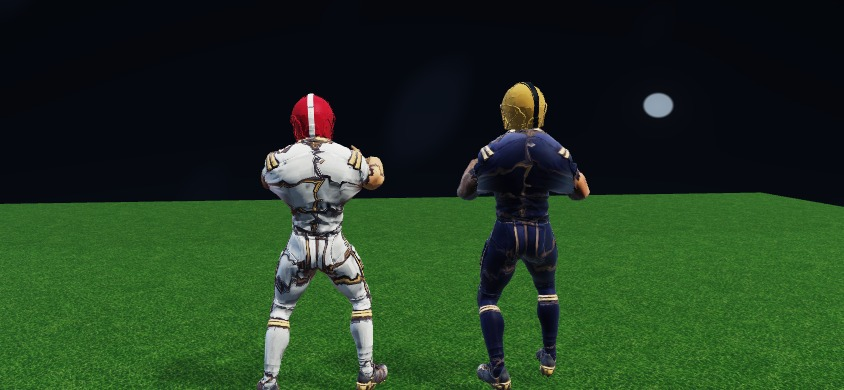
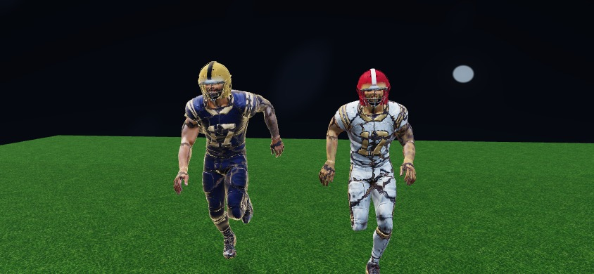
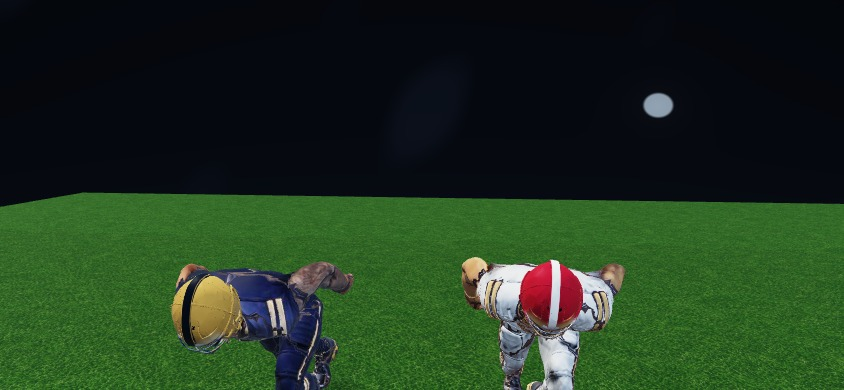
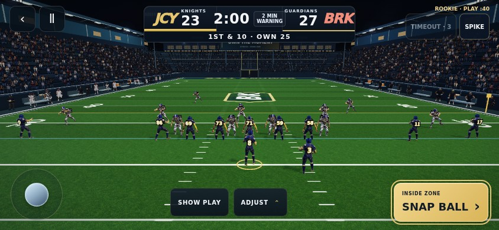

# Full-game helmet regression fix

PR #435 restored a reference renderer whose Tripo athlete had no helmet geometry.
The loader was rendering the complete model: this was the wrong equipment state,
not a missing texture or a browser cache problem.

The two-minute and five-minute renderer now loads `reference-helmeted-athlete-v1.glb`.
It retains the reference body's positions, normals, tangents, skin weights,
skeleton, inverse bind matrices and all 11 animation clips. The saved Sentinel
helmet and facemask are fitted around that head and rigidly weighted to its head
bone. Shell colors follow each team's primary color; the face cage stays distinct.

The combined asset is 5,143,908 bytes, 45,935 triangles and 27 joints. Three
1024×512 atlases keep a single skinned primitive and the existing player draw
count. Both original source assets remain available. Regenerate with
`python scripts/equip-reference-athlete.py` (NumPy, SciPy and Pillow).

Gameplay, the current camera, and the separate Combine renderer are unchanged.
This is an equipment correction to the reference body, not a claim that the
historical QA screenshot has been reproduced exactly.

## Verification

- `npm run build`: passed; existing bundle-size warning.
- `npm run lint`: passed.
- `node scripts/check-five-minute.mjs`: passed, including 90 seeded complete games.
- `BROWSER_PATH=/tmp/chromium node scripts/check-reference-equipment.mjs`: passed.
  Checks real indexed helmet/facemask geometry, exact preservation of body/rig/
  animation data, rigid head weights, both mobile game routes, and no page or
  WebGL errors. Front, rear, running and contact renders were visually inspected.
- Camera coverage is recorded in the PR verification update.

This browser evidence uses Chromium software rendering at 844×390. It does not
establish physical-iPhone Safari performance. Live release verification must
also confirm the production deployment and served HTML, renderer and asset.

## Render evidence

