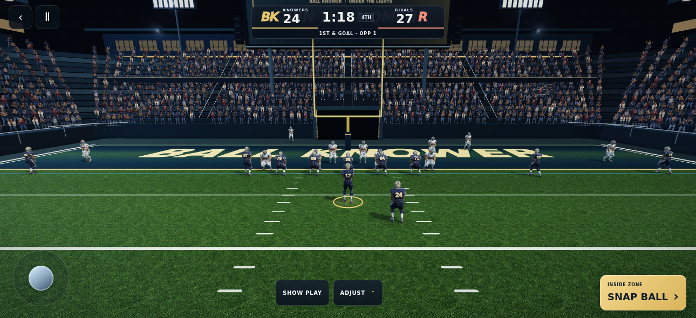

# Stadium finish 36

Further development of PR #376, preserving the approved Sentinel player appearance.

## Changes

- Connect all four stadium corners with rounded, stepped seating rather than separate rectangular stands.
- Shorten and narrow the straight sections to meet those corners, retaining the playable field, tunnel and sideline clearance.
- Add continuous corner guardrails, marked end-zone aisles, suite window mullions with varied interior light, and equipment/drink stations.
- Break up the spectator grid using deterministic position/brightness variation and mirrored atlas poses. Small upper-body sway and bob are evaluated in the GPU shader, independently phased by seat position; reduced-motion freezes the motion.
- Layer small warm lamp cores inside cooler halos; prevent turf grass sheen from coloring painted areas and refine mowing contrast.
- Retain existing automatic camera fit, gameplay controls, actor mesh and material treatment.

The new structure builder checks 1,524 pieces for finite transforms and positions outside the playing field. It introduces 896 corner spectator instances, offset by the smaller straight end sections. Existing instanced shapes and texture atlases are reused.

## Verification

Local type check, production build, camera/marker regression checks, and controller recovery checks passed. The local Chromium executable expired; its replacement download was denied by the environment's domain policy. A dedicated GitHub Actions workflow therefore performs the actual WebGL comparison and mobile/fallback checks on the pushed commit and preserves its renders as the `stadium-36-webgl` artifact.

The comparison baseline is the preceding PR #376 version (`cf37901`), so it isolates this refinement. See the final validation comment on PR #376 for the runner result and production deployment status.

## Remaining limits

Spectators are lightweight atlas cutouts with subtle movement, not individually rigged 3D characters. Software-rendered checks do not certify iPhone performance, battery use or Safari behavior. The existing athlete surface-refinement startup cost is unchanged. Existing unrelated baseline CI failures are not disabled by this workflow.

## Completed graphics gate

GitHub Actions run 36455583305 passed both the actual goal-line before/after render and all 20 mobile formation checks plus optional-art fallback. The captured high-quality scene reports 39 draw calls, 22 shadow draw calls, 57 textures, 15 geometries and zero instance overflows. Stadium instance data increased from 2,714,880 to 2,889,600 bytes. Visual review confirmed connected stands, clear controls and preserved player appearance. Build, type, framing and recovery checks also passed; unrelated repository baseline failures remain.

