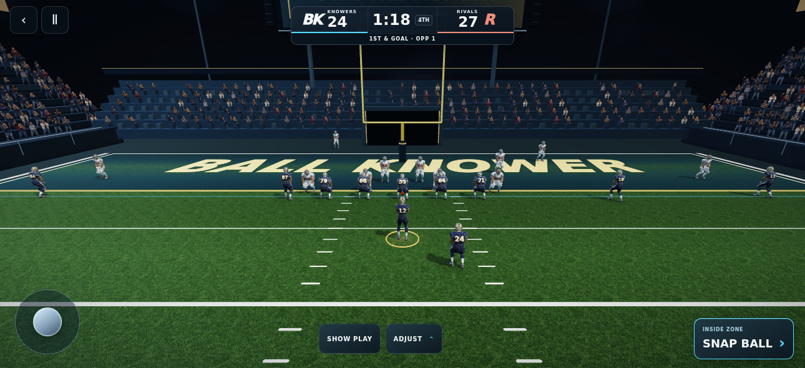
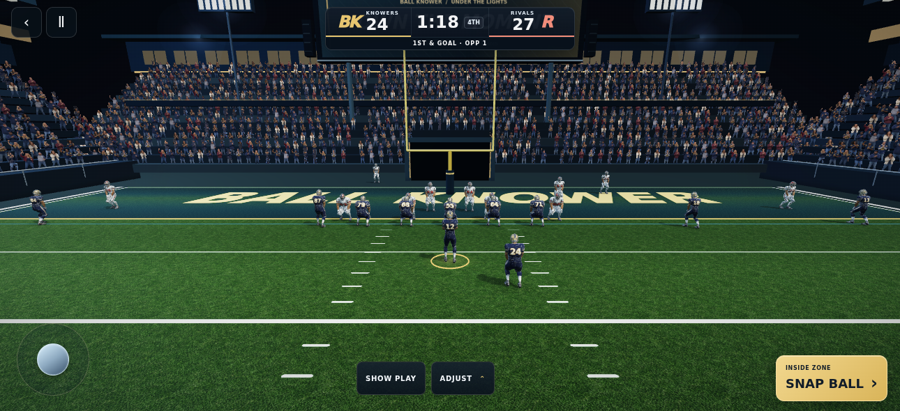

# Stadium presentation pass 35

The approved Sentinel player is retained. This pass addresses the sparse end-zone bowl, low scene contrast, noisy turf and elevated camera seen in the user's live screenshot.

- Extend both end-zone stands from five spectator rows to fourteen, with continuous seating, aisles and a clear player entrance.
- Add warm concourse windows, roof edges and additional lamp halos. Lift distant spectator and architectural exposure without changing the approved athlete shader.
- Correct turf normal sampling: both finite differences now subtract the same raw texture luminance. Reduce high-frequency variation and fade the secondary grain with pixel derivatives.
- Lower the pocket camera while retaining the existing automatic receiver/controls fit and continuous run/pass camera transitions.
- Apply navy/gold broadcast control styling without reducing touch targets or removing controls.
- Increase the bounded instance cap to 8,192 for the larger shared crowd batch. No additional texture assets or render passes.
- Point the default asset gate and recording triangle assertion at the shipped Sentinel v4.

## Render evidence

Actual local Chromium/SwiftShader renders of the production modules, not generated concept images. Both views use the same 1290×590 viewport and first-and-goal at the opponent's one-yard line. The test injects only the drive situation into its local HTTP response.




The goal-line camera eye is 4.96 yards high versus 6.57 before. Both renders use 39 scene draw calls, 22 actor shadow draws and 57 textures, with zero GL errors and zero instance overflows. Allocated instance buffers rise from 1,790,208 to 2,714,880 bytes (about 0.88 MiB additional). See the accompanying report.json.

## Validation

- TypeScript check and production build passed (existing chunk-size warning).
- Default v4 asset validation passed: 39,761 vertices, 31,070 triangles, eight clips, three 2K maps, 6.47 MB.
- Camera/receiver marker checks: 280 camera samples, 2,000 marker clusters, 126 pass lead samples passed.
- Actual controller recovery/run/pass checks at mobile sizes passed, including pre-snap controls, clock handling and camera continuity.
- Locomotion and static night-stadium geometry gates passed.
- Before/after actual WebGL goal-line comparison passed, including texture loads and GL/instance checks.
- Full scene gate passed all 20 formation/viewport combinations (667×320, 844×335, 844×390, 1290×590), with zero page errors. A passing play also started successfully with all three optional stadium artwork requests blocked. The deterministic fixture pauses automatic frames before waiting for assets.

## Limits

This is an environment/presentation improvement, not full reference parity. Spectators remain static atlas cutouts; no physical iPhone frame-rate or thermal certification. The larger crowd needs real-device performance observation. The existing surface-refinement startup cost and unrelated pre-existing CI failures remain open. This branch has not been merged or deployed to production.

## Reproduce

```sh
node scripts/check-play-moment-athlete-v3.mjs
node scripts/check-play-moment-framing.mjs
node scripts/check-football-recovery.mjs
BROWSER_PATH=/path/to/chromium node scripts/check-stadium-presentation.mjs
```

The comparison baseline is production commit 04df7efd; fetch that commit when using a shallow checkout.
